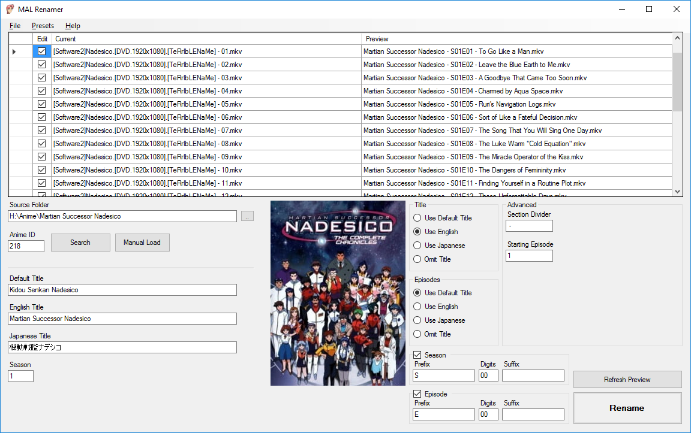

# MAL Renamer
This program will grab series information from [MyAnimeList.net](https://myanimelist.net/) and easily modify the filenames of your files to match a clean, easy to read format.

## Why Another File Renamer?
There are a lot of file renaming tools out there. But I found the process of adding episode titles from various animes to be a chore. This is a dedicated, purpose-built application, whereas most file renaming tools (such as the excellent [Bulk Rename Utility](https://www.bulkrenameutility.co.uk/)) are general-purpose tools. As such, they lack the speed and ease of use that MAL Renamer provides. 

# Features
* Speed! Completely rename an entire series in as few as 7 clicks!
* Integration with My Anime List to grab series and episode information!
* Warnings if you're missing any episodes - Make sure your collection is complete!
* Special manual renaming for extra files (such as intros/outros that don't match MAL)
* Open Source!

# How To Use
1. Click the button next to "Source Folder" and select the anime you want to rename. If your series has multiple seasons, this should be parsed out of the folder name to make searches and naming easier.
2. Click the "Search" button next to "Anime ID". This will bring up a search window to select the correct series. MAL Renamer will attempt to pick the best match based on you folder names, but you'll need to verify this is correct.
3. Verify the "Current" and "Preview" columns match up and look correct. If you have additional files in this folder, uncheck the checkbox in the "Edit" column to omit them from bulk editing. (You can double click those files to do a manual rename.)
4. The default settings are great for just about every show. But if you want a different format, you can tweak the options. (There's a "Presets" area in the top menu bar for some common options.)
5. Click "Rename". Enjoy your cleanly named files!

# Contribute
If there's some functionality missing, please feel free to [add an issue](https://github.com/software-2/MAL-Renamer/issues) describing your needs and suggestions.
